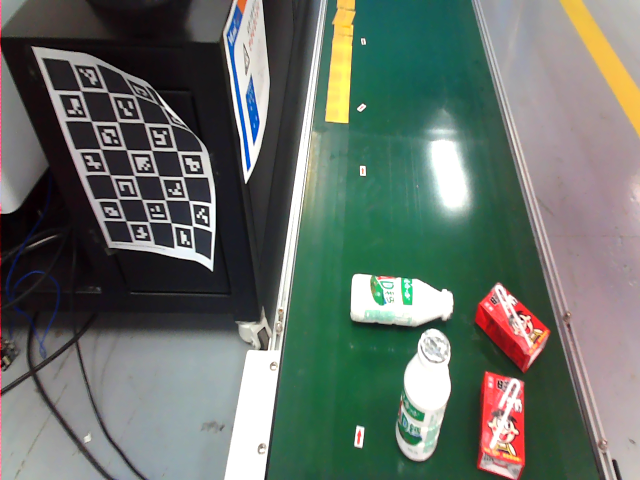
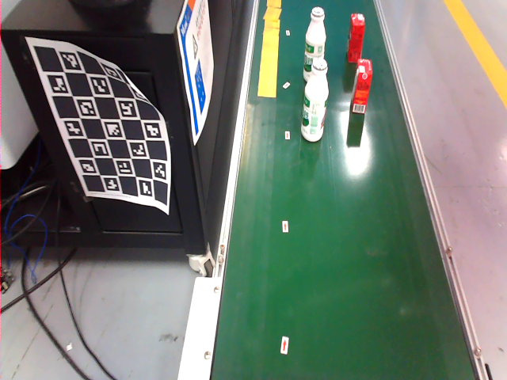
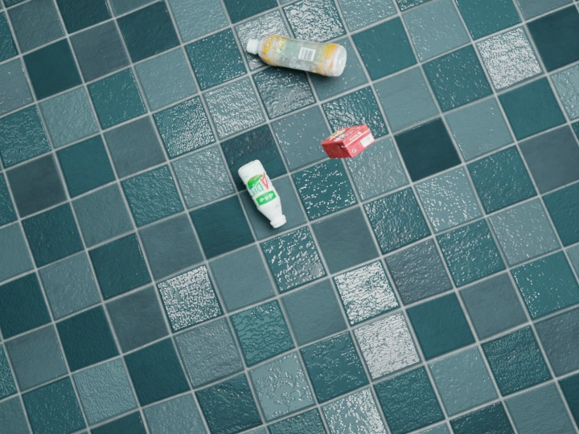

# demo_6D_pose_yuil_robot

| Before Manipulation    | After Manipulation |
| -------- | ------- |
|    |     |

# video of objects
 
```
# Prepare for demo code


# Download demo code and run.
git clone https://github.com/zhaoruinan/demo_6D_pose_yuil_robot.git
cd demo_6D_pose_yuil_robot
```
# Download  [model](https://hanyangackr0-my.sharepoint.com/:u:/g/personal/zhaoruinan_m365_hanyang_ac_kr/EWVFXd-XFYNOqhVaWqnsNAUB1Zu9GLUgmWWPTnCrlTbTiA?e=WQXyMC) for 6D pose estimation 
put it in data/model/pvnet/custom/
``` 
# get the latest image for pvnet docker env
docker pull ruinanzhao/pvnet-clean:latest

sudo vim ~/.bashrc

# add this lines,use "i" to edit
export PVNET_DOCKER=ruinanzhao/pvnet-clean:latest
export PVNET_GIT=$HOME/demo_6D_pose_yuil_robot  # update this with the directory of demo code
source $PVNET_GIT/docker/setup_dev.bash

# use ":wq" to save and exit
source ~/.bashrc

pvnet_docker # By this, a docker env will be run for demo code.

# inside the docker container
conda activate pvnet
python run.py --type online2 --cfg_file configs/custom.yaml

```

# rebuild docker image
```
cd docker
docker build . -t  ruinanzhao/pvnet-clean:latest
```
# make sure the 3D model of an object

# generate dataset of object

```
# dataset directory

git clone https://github.com/DLR-RM/BlenderProc
cd BlenderProc/
pip install blenderproc
blenderproc download cc_textures resources/cctextures

cp $HOME/demo_6D_pose_yuil_robot/bop_object_pose_sampling.py examples/datasets/bop_object_pose_sampling/main.py
cp $HOME/demo_6D_pose_yuil_robot/milk_dataset.sh ./
sudo chmod +x milk_dataset.sh
./milk_dataset.sh
```
# train pvnet model for new object
